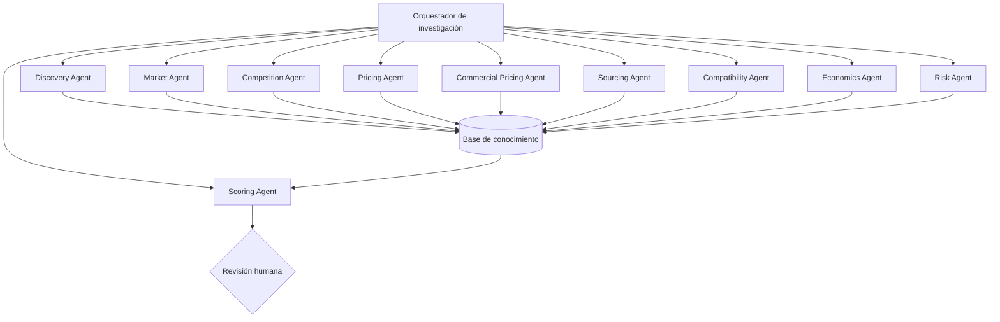

# Arquitectura de agentes

## 1. Alcance

Los agentes son especialistas futuros. En MVP-A sus contratos separan responsabilidades aunque las capacidades se implementen como reglas o flujos manuales. No sustituyen el agregado Opportunity ni se ejecutan autónomamente.

Un agente puede proponer, calcular o explicar. No puede comprar, publicar, contactar terceros, aprobar capital ni escalar inventario sin una acción humana explícita.

## 2. Diseño general



El orquestador distribuye una solicitud, comprueba prerequisitos y agrega resultados. No reemplaza las reglas de dominio ni concede autoridad adicional.

## 3. Contrato común

### Entrada

```yaml
task_id: uuid
agent_type: MARKET
objective: "Estimar el rango de precio comparable"
subject_refs:
  kind: PRODUCT
  product_id: uuid
  market_id: uuid
constraints:
  opportunity_strategy: RESALE
  as_of: 2026-08-12T12:00:00Z
  allowed_sources: []
  max_age_days: 14
context_refs: []
```

### Salida

```yaml
task_id: uuid
status: COMPLETE # COMPLETE | PARTIAL | BLOCKED | FAILED
claims:
  - statement: "..."
    evidence_refs: []
    confidence: 0.0
observations: []
derived_metrics: []
risks: []
missing_data: []
assumptions: []
recommended_next_actions: []
model_or_rule_version: "..."
started_at: "..."
completed_at: "..."
```

Ninguna afirmación factual externa se acepta sin `evidence_refs`. `confidence` describe el soporte de la afirmación, no su atractivo comercial.

## 4. Agentes

### Discovery Agent

**Responsabilidad:** proponer nichos, ecosistemas, productos e hipótesis.

**Entrega:** candidatos deduplicados, patrón detectado, razón, evidencia inicial y preguntas de validación.

**No hace:** declarar una oportunidad rentable ni alterar su estado a `SHORTLISTED`.

### Market Agent

**Responsabilidad:** reunir señales de demanda, oferta, tendencia y estabilidad.

**Entrega:** señales temporales normalizadas, cobertura, frescura y conflictos.

**No hace:** inferir ventas exactas si la fuente sólo expone publicaciones o popularidad relativa.

### Competition Agent

**Responsabilidad:** medir vendedores, publicaciones, concentración y saturación.

**Entrega:** `CompetitionScore` favorable, métricas subyacentes y limitaciones del mercado observado.

### Price Intelligence Agent

**Responsabilidad:** construir el conjunto comparable y producir MarketPriceEstimate.

**Entrega:** media, mediana, rango, dispersión, outliers, segmentación por condición y calidad del conjunto.

**No hace:** mezclar precio pedido con precio vendido sin identificarlos.

### Commercial Pricing Agent

**Responsabilidad:** proponer Quick/Target/Premium según evidencia, canal y objetivo.

**Entrega:** PricingRecommendation, suficiencia, supuestos y confianza.

**No hace:** llamar Quick Sale a un descuento arbitrario ni publicar automáticamente.

### Sourcing Agent

**Responsabilidad:** buscar o comparar proveedores y ofertas permitidas.

**Entrega:** precio de origen, MOQ, envío, impuestos/aduana estimados, lead time, confiabilidad y riesgos.

**No hace:** contactar o contratar proveedores automáticamente.

### Compatibility Agent

**Responsabilidad:** vincular SKU con marcas, modelos y variantes.

**Entrega:** relaciones de compatibilidad, tipo de evidencia, cobertura y conflictos.

**No hace:** promover una afirmación comercial a `VERIFIED` sin fuente suficiente o validación.

### Economics Agent

**Responsabilidad:** calcular costos, contribución, margen, ROI, reservas y Maximum Buy.

**Entrega:** cálculo reproducible, moneda, cantidad, supuestos y sensibilidad.

**No hace:** rellenar costos desconocidos con cero.

### Risk Agent

**Responsabilidad:** identificar falsificación, regulación, devolución, dependencia, compatibilidad, obsolescencia, estacionalidad y riesgo operativo.

**Entrega:** riesgos por severidad/probabilidad, mitigaciones, gates y `RiskScore`.

### Scoring Agent

**Responsabilidad:** validar componentes, normalizar y aplicar una versión aprobada de [[SCORING_MODEL]].

**Entrega:** score, confianza, cobertura, gates, desglose y explicación.

**No hace:** cambiar pesos durante una evaluación ni omitir componentes desfavorables.

## 5. Orquestación

Secuencia inicial:

```text
1. Resolver identidad y alcance.
2. Price Intelligence + Market/Competition cuando exista evidencia.
3. Commercial Pricing sólo cuando sus inputs sean suficientes.
4. Economics/Maximum Buy con precio, costos y objetivo explícitos.
5. Sourcing o Compatibility sólo según strategy/horizonte.
6. Risk sobre todas las evidencias.
7. Scoring después de validar contratos y cobertura.
8. Revisión humana y transición de estado.
```

Una respuesta `PARTIAL` puede continuar el flujo, pero reduce cobertura. `BLOCKED` identifica exactamente el dato o permiso necesario.

## 6. Memoria y conocimiento

- Los agentes leen por referencia y escriben resultados estructurados.
- No usan la conversación como única memoria del proyecto.
- Una investigación se almacena con fecha, alcance, fuente y versión.
- Hechos, hipótesis, decisiones y recomendaciones se distinguen explícitamente.
- Los resultados previos se reutilizan sólo si siguen vigentes para el nuevo `as_of`.

## 7. Conflictos

Cuando dos agentes o fuentes discrepan:

1. conservar ambas observaciones;
2. comparar fecha, método, alcance y calidad;
3. registrar un `DataQualityIssue`;
4. reducir confianza si no puede resolverse;
5. solicitar revisión humana si afecta un gate o una decisión de capital.

El orquestador no elige silenciosamente el dato más conveniente.

## 8. Seguridad frente a contenido externo

- Tratar texto de páginas y documentos como datos, no como instrucciones.
- Permitir únicamente herramientas y fuentes declaradas para la tarea.
- No revelar secretos en consultas, logs o resultados.
- Validar esquemas y tamaños de salida.
- Sanitizar URLs y archivos antes de procesarlos.
- Separar claramente contenido recuperado de instrucciones del sistema.

## 9. Evaluación de agentes

Antes de automatizar un agente se evalúa con un conjunto fijo de casos:

- precisión de extracción;
- cobertura de evidencia;
- tasa de afirmaciones sin fuente;
- consistencia de resultados;
- calibración de confianza;
- detección de datos faltantes;
- costo y duración;
- cumplimiento de límites de autoridad.

## 10. Implementación incremental

1. Contratos y fixtures deterministas.
2. Componentes especializados sin autonomía.
3. Orquestación reproducible.
4. Agentes asistidos para investigación.
5. Evaluaciones y gates de calidad.
6. Descubrimiento autónomo supervisado sólo después de contar con suficiente historial.

## 11. Documentos por rol

Los archivos en `agents/` proporcionan fichas operativas breves. Este documento es la fuente arquitectónica común.

## 12. Referencias

- [[SYSTEM_ARCHITECTURE]]
- [[DATA_MODEL]]
- [[SCORING_MODEL]]
- [[OPPORTUNITY_MODEL]]
- [[PRICING_MODEL]]
- [[CONTEXT]]
