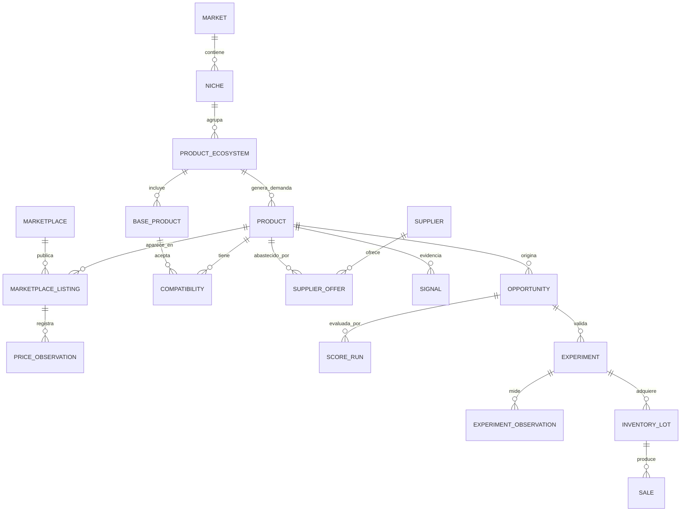

# Modelo de datos

## 1. Objetivo

Definir un modelo canónico que preserve historia y procedencia, permita comparar oportunidades y no dependa del esquema de una fuente específica.

## 2. Convenciones

- Identificadores internos: UUID o equivalente, generados por el sistema.
- Identificadores externos: se conservan junto a `source_id`.
- Fechas operativas: UTC en formato ISO 8601.
- Dinero: monto decimal y código ISO 4217; nunca `float` binario.
- Cantidades: valor y unidad explícita.
- Datos desconocidos: `null/unknown`, nunca cero implícito.
- Observaciones: append-only; una corrección agrega una nueva versión o marca invalidez con motivo.
- Derivados: conservan `calculation_version`, inputs y timestamp.
- Borrado lógico cuando la auditoría o una relación histórica lo exijan.

## 3. Vista conceptual



## 4. Entidades de taxonomía

### Market

Ámbito geográfico y comercial.

| Campo | Tipo | Regla |
|---|---|---|
| `id` | ID | requerido |
| `name` | texto | requerido |
| `country_code` | ISO 3166-1 | requerido |
| `currency_code` | ISO 4217 | requerido |
| `timezone` | IANA | requerido |
| `status` | enum | `ACTIVE`, `INACTIVE` |

### Niche

Segmento comercial investigable.

Campos mínimos: `id`, `market_id`, `name`, `description`, `status`, `current_score_run_id`, `created_at`, `updated_at`.

### ProductEcosystem

Máquina, actividad o sistema que genera demanda relacionada.

Campos mínimos: `id`, `niche_id`, `name`, `description`, `ecosystem_type`, `status`.

### BaseProduct

Equipo o producto instalado que acepta consumibles o repuestos.

Campos mínimos: `id`, `ecosystem_id`, `brand`, `model`, `variant`, `identifiers`, `status`.

## 5. Catálogo e identidad

### Product

Identidad canónica de un SKU o producto comercializable.

| Campo | Tipo | Regla |
|---|---|---|
| `id` | ID | requerido |
| `canonical_name` | texto | requerido |
| `brand` | texto nullable | no inventar si falta |
| `model` | texto nullable | normalizado |
| `variant_attributes` | mapa | color, tamaño, capacidad, etc. |
| `category` | referencia/texto | taxonomía versionada |
| `product_kind` | enum | `BASE`, `CONSUMABLE`, `PART`, `ACCESSORY`, `OTHER` |
| `manufacturer_identifiers` | lista | SKU, GTIN, MPN, EAN, UPC |
| `unit_quantity` | decimal | cantidad vendida |
| `unit_of_measure` | enum | unidad normalizada |
| `status` | enum | `CANDIDATE`, `ACTIVE`, `MERGED`, `INACTIVE` |
| `merged_into_id` | ID nullable | sólo si `MERGED` |

`Consumable` se representa inicialmente mediante `product_kind=CONSUMABLE` y atributos de reposición. Sólo se separará como entidad si aparecen reglas exclusivas suficientes.

### ProductAlias

Nombre observado asociado a un producto canónico: `id`, `product_id`, `source_id`, `raw_name`, `normalized_name`, `locale`, `confidence`, `created_at`.

### Compatibility

Relación entre un `Product` y un `BaseProduct`.

Campos: `id`, `product_id`, `base_product_id`, `compatibility_type`, `status`, `confidence`, `evidence_refs`, `validated_by`, `validated_at`.

Estados: `CLAIMED`, `VERIFIED`, `CONFLICTED`, `REJECTED`. Una afirmación del vendedor no equivale a compatibilidad verificada.

## 6. Fuentes, publicaciones y precios

### DataSource

Registro de procedencia: `id`, `name`, `source_type`, `base_url`, `access_method`, `terms_reference`, `retention_policy`, `status`.

### Marketplace

Plataforma dentro de un mercado: `id`, `market_id`, `data_source_id`, `name`, `fee_policy_version`.

### MarketplaceListing

Publicación externa, separada de sus observaciones temporales.

Campos mínimos:

```text
id
marketplace_id
external_listing_id
canonical_url
seller_external_id
raw_title
product_id?
condition
listing_type
first_seen_at
last_seen_at
status
identity_confidence
```

### ListingSnapshot

Captura permitida de atributos variables: `id`, `listing_id`, `observed_at`, `price`, `currency`, `shipping_price`, `stock_claim`, `units_sold_claim`, `seller_reputation`, `content_hash`, `raw_ref`, `capture_run_id`.

### PriceObservation

Observación canónica de precio usada en análisis.

Campos: `id`, `subject_type`, `subject_id`, `price_type`, `amount`, `currency`, `condition`, `quantity`, `observed_at`, `source_id`, `snapshot_id`, `conversion_ref`, `quality_status`.

`price_type`: `ASKING`, `SOLD`, `SUPPLIER`, `REFERENCE`, `INTERNAL_SALE`. Los precios publicados y vendidos nunca se mezclan sin diferenciación.

## 7. Señales

### Signal

Sobre común para evidencia temporal:

```text
id
subject_type
subject_id
signal_type
value
unit
direction
observed_at
valid_until?
source_id
evidence_ref
quality_score
method_version
```

Tipos iniciales: `DEMAND`, `SUPPLY`, `COMPETITION`, `TREND`, `INSTALLED_BASE`, `REPLENISHMENT_INTERVAL`, `RISK`.

Los nombres conceptuales `DemandSignal`, `SupplySignal`, `CompetitionSignal` y `TrendSignal` son especializaciones de este sobre. Se separarán físicamente sólo si requieren atributos propios.

## 8. Abastecimiento y economía

### Supplier

Campos: `id`, `name`, `market_id`, `website`, `verification_status`, `reliability_score`, `risk_notes`, `created_at`, `updated_at`.

### SupplierOffer

Oferta temporal de un proveedor: `id`, `supplier_id`, `product_id`, `supplier_sku`, `unit_price`, `currency`, `moq`, `lead_time_days`, `incoterm`, `valid_from`, `valid_until`, `source_id`, `observed_at`.

### EconomicsRun

Resultado reproducible:

```text
id
opportunity_id
calculation_version
currency
quantity
supplier_price
inbound_shipping
taxes
customs
landed_cost
sale_price
marketplace_fee
payment_fee
outbound_shipping
packaging_cost
other_variable_cost
gross_profit
contribution_margin
roi
expected_days_to_sell
capital_efficiency
assumptions
input_refs
calculated_at
```

Fórmulas base:

```text
landed_cost = supplier_price + inbound_shipping + taxes + customs
contribution = sale_price - landed_cost - marketplace_fee
               - payment_fee - outbound_shipping - packaging_cost
contribution_margin = contribution / sale_price
roi = contribution / capital_invested
capital_efficiency = expected_contribution / (capital_invested × expected_holding_period)
```

Las unidades de tiempo de `capital_efficiency` deben declararse; la comparación usa la misma base.

## 9. Oportunidades y scoring

### Opportunity

| Campo | Tipo | Regla |
|---|---|---|
| `id` | ID | requerido |
| `product_id` | ID | requerido en MVP |
| `market_id` | ID | requerido |
| `opportunity_type` | enum | según [[OPPORTUNITY_TYPES]] |
| `status` | enum | ciclo definido en [[PRD]] |
| `hypothesis` | texto | requerido |
| `current_score_run_id` | ID nullable | puntero, no sobreescribe histórico |
| `owner_id` | ID nullable | responsable humano |
| `rejection_reason` | texto nullable | requerido al rechazar |
| `created_at`, `updated_at` | timestamp | requeridos |

### ScoreRun

Campos: `id`, `opportunity_id`, `score_model_version`, `component_scores`, `weights`, `opportunity_score`, `risk_score`, `confidence_score`, `coverage`, `gates`, `explanation`, `input_refs`, `calculated_at`.

### OpportunityTransition

Auditoría de estado: `id`, `opportunity_id`, `from_status`, `to_status`, `actor_id`, `reason`, `evidence_refs`, `occurred_at`.

## 10. Experimentos y aprendizaje

### Experiment

Campos mínimos:

```text
id
opportunity_id
name
status
hypothesis
quantity
capital_amount
currency
start_date
end_date
target_sales
target_margin
target_days_to_sale
success_criteria
stop_conditions
predictions
decision
decision_reason
```

Estados: `DRAFT`, `APPROVED`, `RUNNING`, `COMPLETED`, `CANCELLED`.

### ExperimentObservation

Serie temporal de `views`, `clicks`, `messages`, `questions`, `units_sold`, `returns`, `repeat_purchase` y costos reales. Campos comunes: `id`, `experiment_id`, `metric`, `value`, `unit`, `observed_at`, `source_id`.

### InventoryLot

Lote asociado a experimento u operación: `id`, `experiment_id`, `product_id`, `quantity_received`, `unit_landed_cost`, `currency`, `received_at`, `status`.

### Sale

Venta real: `id`, `inventory_lot_id`, `channel`, `quantity`, `gross_revenue`, `fees`, `shipping_cost`, `returns_amount`, `currency`, `sold_at`.

### SalesObservation

Agregado derivado y versionado para análisis, no sustituto de `Sale`.

## 11. Calidad y auditoría

### CaptureRun

Ejecución de adquisición: fuente, versión de conector, parámetros no secretos, conteos, estado, errores, inicio y fin.

### DataQualityIssue

Problema explícito: entidad afectada, tipo, severidad, descripción, evidencia, estado y resolución.

### AuditEvent

Cambios manuales relevantes: actor, acción, entidad, antes/después permitido, motivo e instante.

## 12. Restricciones esenciales

- Un `ScoreRun` apunta a inputs existentes y no mutables.
- Una oportunidad tiene sólo un score actual, pero conserva todos los anteriores.
- No se valida un experimento sin criterios definidos antes de `RUNNING`.
- `actual_*` no puede cargarse como `predicted_*` ni viceversa.
- Una compatibilidad en conflicto reduce confianza y no se presenta como verificada.
- Cada conversión monetaria conserva tasa, moneda origen/destino, fuente y fecha.
- Una fusión de productos no elimina aliases, listings ni auditoría.

## 13. Datos mínimos para el primer incremento

Implementar primero:

```text
Product
ProductAlias
DataSource
Marketplace
MarketplaceListing
ListingSnapshot
PriceObservation
Opportunity
EconomicsRun
ScoreRun
OpportunityTransition
```

Las demás entidades se introducen al activar la épica que las necesita.

## 14. Referencias

- [[SYSTEM_ARCHITECTURE]]
- [[PRD]]
- [[SCORING_MODEL]]
- [[EXPERIMENTATION]]
