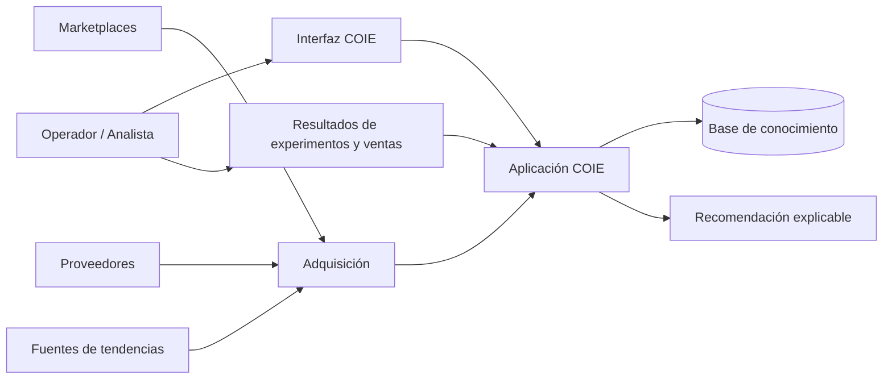
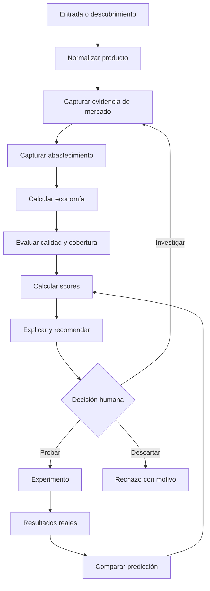

# Arquitectura del sistema

## 1. Propósito

Definir límites estables para evolucionar COIE de forma incremental sin acoplar fuentes externas, reglas de negocio, scoring y experiencia de usuario.

Este documento describe una arquitectura lógica independiente del stack. La selección de lenguaje, base de datos, framework y despliegue se registrará en ADR separados.

## 2. Principios arquitectónicos

- **Dominio primero:** productos, observaciones, oportunidades y experimentos no dependen de un marketplace específico.
- **Procedencia obligatoria:** todo dato externo conserva fuente, instante de captura y método.
- **Histórico inmutable:** una nueva captura agrega observaciones; no reescribe el pasado.
- **Cálculos reproducibles:** derivados y scores registran versión, parámetros y observaciones utilizadas.
- **Separación de incertidumbre:** score, confianza y cobertura son valores distintos.
- **Conectores reemplazables:** cada fuente se adapta a un contrato canónico.
- **Automatización supervisada:** ninguna recomendación ejecuta compras o escalamiento en el MVP.
- **Incrementos verticales:** cada fase debe entregar un flujo demostrable de extremo a extremo.

## 3. Contexto



Los términos de servicio, límites de acceso y disponibilidad de cada fuente son restricciones externas. La arquitectura no presupone que toda señal pueda obtenerse mediante scraping.

## 4. Capas lógicas

```text
Experience
  Dashboard · Detail View · Experiment Tracking

Application
  Use Cases · Workflow · State Transitions · Authorization

Domain Intelligence
  Product · Market · Economics · Compatibility · Risk · Scoring

Data Acquisition
  Connectors · Raw Capture · Mapping · Validation · Deduplication

Knowledge & Storage
  Canonical Entities · Observations · Lineage · Score Runs · Audit Log

External Systems
  Marketplaces · Suppliers · Trends · Manual Imports · Sales Channels
```

Una capa sólo utiliza contratos de la capa inferior o puertos explícitos. Un conector no calcula `OpportunityScore`; un componente de scoring no interpreta HTML ni conoce selectores de una fuente.

## 5. Componentes

### 5.1 Experience

- **Opportunity Dashboard A:** ranking operativo, filtros, cobertura y estados.
- **Opportunity Detail B:** evidencia, distribución de precios, economía, scores, riesgos y recomendación.
- **Experiment Workspace:** hipótesis, límites, métricas y comparación predicción/resultado.
- **Data Quality View:** datos faltantes, antigüedad, conflictos y fallos de fuentes.

La primera interfaz es web. Durante Foundation consume un repositorio DEMO mediante los mismos puertos que utilizará la persistencia real.

### 5.2 Identity & Access

- Supabase Auth será el proveedor de identidad del MVP.
- `Workspace` define el límite de propiedad y colaboración.
- `WorkspaceMember` concede acceso explícito.
- Las entidades comerciales incluyen `workspace_id`.
- PostgreSQL Row Level Security aplicará el aislamiento cuando se integre Supabase.
- Foundation modela el contrato, pero no simula una autenticación real sin proyecto ni credenciales.

### 5.3 Application Services

- `AnalyzeProduct`: coordina identidad, observaciones, economía y scoring.
- `RefreshMarketEvidence`: actualiza señales sin borrar el histórico.
- `EvaluateOpportunity`: ejecuta reglas, gates y score versionado.
- `TransitionOpportunity`: aplica la máquina de estados y registra auditoría.
- `CreateExperiment`: congela hipótesis, predicciones y criterios iniciales.
- `RecordExperimentObservation`: incorpora métricas reales.
- `CloseExperiment`: compara resultado y recomienda decisión humana.

### 5.4 Domain Intelligence

- **Product Intelligence:** identidad, atributos, variantes y normalización.
- **Market Intelligence:** comparables, estadísticas, demanda y competencia.
- **Sourcing Intelligence:** proveedores, MOQ, lead time y landed cost.
- **Compatibility Intelligence:** relación producto–modelo y cobertura.
- **Economics:** precio neto, costos, margen, ROI y capital efficiency.
- **Risk:** señales regulatorias, falsificación, devolución, dependencia y obsolescencia.
- **Scoring:** normalización, agregación, confianza, gates y explicación.

### 5.5 Acquisition

Todo conector implementa conceptualmente:

```text
discover(query, cursor) -> RawRecord[]
fetch(reference) -> RawRecord
map(raw_record) -> CanonicalCandidate
health() -> SourceHealth
```

Pipeline por lote:

```text
Acquire → Persist Raw → Validate → Map → Resolve Identity
        → Deduplicate → Append Observation → Publish Result
```

`Persist Raw` es opcional cuando la licencia o los términos impiden conservar el contenido original; en ese caso se conserva únicamente la procedencia permitida y el registro del método.

### 5.6 Knowledge & Storage

Almacena:

- entidades canónicas;
- registros fuente y observaciones temporales;
- relaciones y compatibilidades;
- oportunidades y transiciones;
- ejecuciones de cálculo y scoring;
- experimentos, predicciones y resultados;
- auditoría y calidad de datos.

El diseño lógico está en [[DATA_MODEL]].

## 6. Flujo de extremo a extremo



## 7. Contratos de datos

Cada comando o resultado de análisis incluye:

- `correlation_id` para rastrear una ejecución;
- `observed_at` o `calculated_at`;
- `source_id` cuando proviene del exterior;
- `schema_version`;
- moneda y unidad explícitas;
- indicador de calidad y advertencias;
- referencias a los registros de origen.

Los timestamps se almacenan en UTC y se muestran en la zona del usuario.

## 8. Idempotencia e identidad

- Una publicación se identifica por `marketplace_id + external_listing_id`; si falta un ID estable se usa una huella versionada y se marca menor confianza.
- Una observación se deduplica con fuente, entidad, tipo, instante o ventana de captura y huella de contenido.
- La resolución de productos puede proponer una coincidencia automática, pero las fusiones ambiguas requieren confirmación y son reversibles mediante auditoría.
- Un proveedor y su oferta son entidades separadas: el mismo proveedor puede cambiar precio, MOQ o lead time.

## 9. Fallos y degradación

- El fallo de un conector no elimina datos previos.
- Una ejecución parcial termina con estado `PARTIAL`, lista de fuentes fallidas y cobertura recalculada.
- El sistema no reutiliza silenciosamente datos vencidos; los presenta con su antigüedad.
- Cálculos inválidos se registran como error de dominio, no como cero.
- Reintentos deben ser acotados, observables e idempotentes.

## 10. Seguridad y cumplimiento

- Secretos fuera del repositorio y separados por entorno.
- Acceso mínimo necesario a fuentes y almacenamiento.
- Sanitización de contenido externo antes de mostrarlo o procesarlo.
- Lista permitida de conectores y métodos de captura.
- La carga manual registra por separado la fuente externa y `MANUAL_USER_ENTRY` como método.
- Una página pública no se considera automáticamente autorizada para scraping.
- Registro de licencias, términos, rate limits y política de retención por fuente.
- Aprobación humana antes de desplegar capital, publicar o contactar proveedores.

## 11. Observabilidad

Por ejecución se registran:

- fuente y versión del conector;
- inicio, fin y duración;
- registros descubiertos, aceptados, rechazados y duplicados;
- errores por categoría;
- frescura y cobertura resultantes;
- versión de normalizadores y score.

## 12. Evolución por fases

1. **Foundation:** documentación, contratos, datos de ejemplo y ADR.
2. **Market Price Intelligence:** producto, listing, precio e histórico.
3. **Resale:** economía, riesgo y ranking `RESALE`.
4. **Replenishment:** ecosistemas, compatibilidad y recurrencia.
5. **Sourcing:** ofertas, landed cost y riesgos de proveedor.
6. **Experiments:** predicción, ejecución y resultado.
7. **Learning:** calibración basada en resultados suficientes.
8. **Autonomous Discovery:** agentes supervisados proponiendo hipótesis.

## 13. Decisiones abiertas

- cola/eventos sólo si el volumen lo justifica;
- almacenamiento de capturas crudas según cada fuente;
- primer conector real y su mecanismo autorizado;
- reglas cuantitativas de frescura y calibración.

No se introduce infraestructura distribuida antes de que exista una necesidad medible.

## 14. Referencias

- [[PRD]]
- [[DATA_MODEL]]
- [[AGENT_ARCHITECTURE]]
- [[SCORING_MODEL]]
- [[ADR-002]]
- [[ADR-003]]
- [[ADR-004]]
- [[ADR-005]]
- [[ADR-001]]
